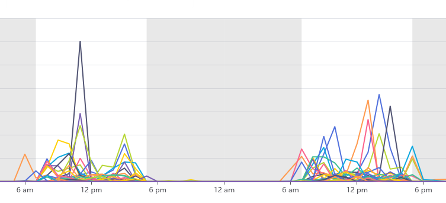
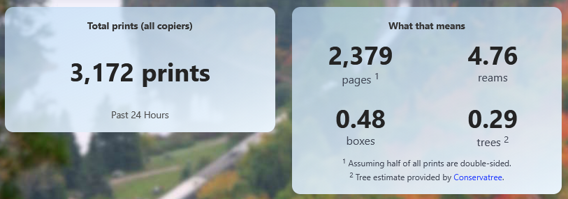

# Office Copier Challenge

**An initiative to help reduce paper usage**
**by tracking how much we print on the office copiers.**

**The Green Team** has challenged all departments to increase the sustainability
efforts in their workplaces. IT is up for the challenge and has created
this dashboard to help everyone understand their department's printing habits
and identify opportunities to reduce paper use.

📺 [**Watch our project intro video**](./public/images/video.mp4)

## How it Works

This dashboard collects total print counts from the office copiers
every twenty minutes. _Desktop printers are not included in the totals._
The difference between data points from the current and previous hour are used
to estimate the number of prints for each copier for each hour.

More questions? See the [FAQ](#frequently-asked-questions-faqs) below.

## How Can I Use This Dashboard?

- **Compare printing trends** and identify opportunities to print less.
- **Challenge another department** with similar printing levels
  to reduce their printing with you and compete to be the most sustainable department!
- **Aim for a "green team" copier** by reducing your prints and moving down
  to the low usage tier!

## Frequently Asked Questions (FAQs)

### What is considered a print?

A print is anything printed from the office copier,
including desktop print jobs and photocopies.

### If I print on both sides of a page, how many prints is that?

Printing on both sides of a page, or duplex printing, is considered two prints.
Printing two pages on the same side of a piece of paper however would be
considered one print.

### How are the number of prints calculated?

Every twenty minutes, the total print count is requested from each copier.
Similar to a car's odometer, that count is the total number of prints
the copier has made since installation.

To estimate the number of prints made within an hour, the difference between
the given hour and the previous hour is calculated.

### Why is my print job appearing in the wrong hour?

Given that total print count provided by the copiers is similar to a car's odometer
and has no time associated with it, the exact time each print was made is not known.
For this reason, depending on when polling occurs, a print job may appear in the
following hour, or in the event of a polling issue, in the hour of the
next successful poll.

### Why aren't desktop printers included?

Most office copiers have a method to retrieve print counts programatically.
Oftentimes, desktop printers don't support remote management.

## Tips to Reduce your Prints

**Every print job reduced helps!**

Even small changes in printing habits can add up to significant paper
and energy savings over time. Ask the IT Helpdesk if you need help putting any
of these tips into practice!

### Check Your Work Before Printing

- **Proofread documents on-screen** to avoid reprints for typos or formatting issues.
- **Use print preview** to check formatting and catch errors before printing.

### Fill Each Page

- **Use smaller font sizes and reduced margins** to fit more content per page.
- **Print multiple pages per sheet** (e.g. 2 or 4) for drafts or reference materials.
- **Print double-sided (duplex)** to cut paper use in half.
- **Print only the pages you need** using "Print Selection" or specifying page ranges.
- **Use draft or economy print quality** for internal documents.

### Skip Printing Altogether

- **Share documents digitally** via email or shared drives instead of printing copies.
- **Cancel unnecessary print jobs** before they complete.
- **Use electronic tools** like fillable forms, electronic signatures,
  and electronic redaction instead of printing and handling physical documents.
